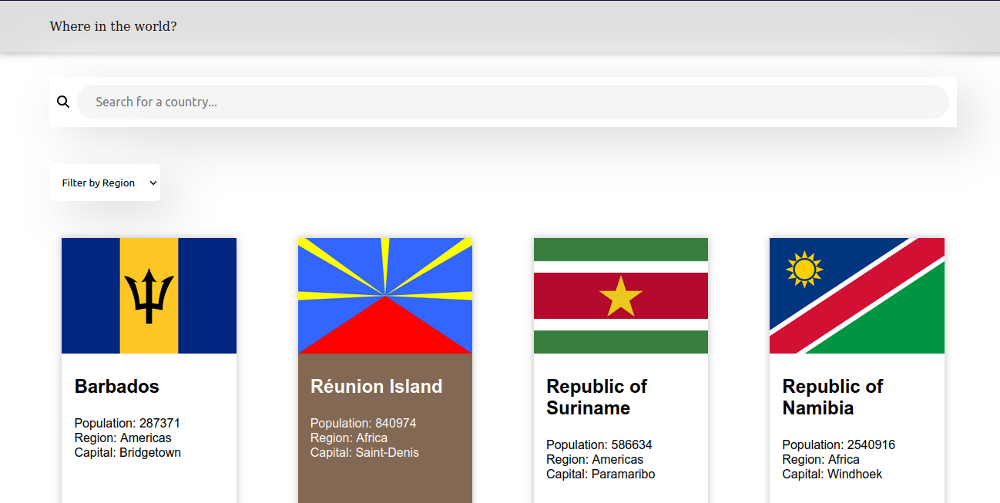

# Fetch Countries
A frontend project that fetches data from an API using Next.js getStaticProps and getStaticPaths

**Link to project:** [https://fetch-countries.vercel.app/](https://fetch-countries.vercel.app/)

## How It's Made:

**Tech used:** Next.js and TailwindCSS 

The UI is from frontendmentors. Nextjs was used to fetch data about countries from the countries API, then, users can search for a country or filter by region and also get details about each country by clicking on them. 

## Optimizations

Dark and light theme switcher 

## Lessons Learned:

How to implement the search and filter, Next.js getStaticProps and getStaticPaths
